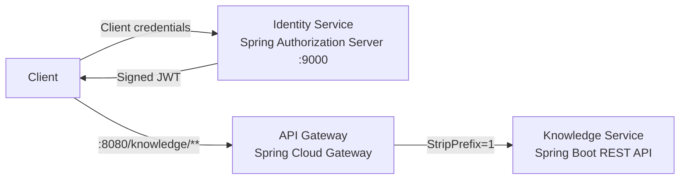

# Enterprise AI Knowledge Platform

A production-oriented Java microservices portfolio project combining Spring Boot backend engineering with AI, event-driven architecture, security, and observability.

## Current milestone

Milestone 1 established the platform foundation:

- `api-gateway` provides the external entry point on port `8080`.
- `knowledge-service` provides the first backend API on port `8081`.
- Spring Cloud Gateway forwards `/knowledge/**` requests to the Knowledge Service.
- Spring Boot Actuator supplies health endpoints for both applications.
- Automated tests verify startup, forwarding, prefix removal, and unknown routes.

Milestone 2 is introducing identity and security. Its first feature adds an
`identity-service` on port `9000` that issues signed JWT access tokens through
the OAuth2 client-credentials grant. Gateway authentication and Knowledge
Service authorization will follow in separate feature branches.

## Architecture



See [Architecture](docs/architecture.md) for details.

## Technology baseline

- Java 21
- Spring Boot 3.5.15
- Spring Cloud 2025.0.3
- Maven multi-module build
- Spring Cloud Gateway Server WebFlux
- Spring Security and Spring Authorization Server
- OAuth2 client credentials and signed JWTs
- Spring Boot Actuator
- JUnit 5, MockMvc, WebTestClient, and Reactor Netty

## Build and test

```bash
mvn clean test
```

## Run locally

```bash
mvn -pl knowledge-service spring-boot:run
mvn -pl api-gateway spring-boot:run
mvn -pl identity-service spring-boot:run
```

Run each application in a separate terminal.

## Verified endpoints

| Purpose | URL | Expected result |
|---|---|---|
| Knowledge Service directly | `http://localhost:8081/api/v1/platform/info` | Service information JSON |
| Through API Gateway | `http://localhost:8080/knowledge/api/v1/platform/info` | Same service information JSON |
| Gateway health | `http://localhost:8080/actuator/health` | `UP` |
| Knowledge Service health | `http://localhost:8081/actuator/health` | `UP` |
| Identity Service health | `http://localhost:9000/actuator/health` | `UP` |
| Authorization Server metadata | `http://localhost:9000/.well-known/oauth-authorization-server` | OAuth2 endpoint metadata |
| JSON Web Key Set | `http://localhost:9000/oauth2/jwks` | RSA public signing key |
| Unknown Gateway route | `http://localhost:8080/unknown` | HTTP `404` |

## Documentation

- [Architecture](docs/architecture.md)
- [Local development](docs/local-development.md)
- [Identity and security](docs/security.md)
- [Branching workflow](docs/branching-workflow.md)
- [Milestones](docs/milestones.md)

## Planned capabilities

Future work will complete OAuth2/JWT enforcement and introduce PostgreSQL and PGVector, Kafka, Java-native AI agents, resilience patterns, Testcontainers, distributed tracing, metrics, and cloud deployment.
