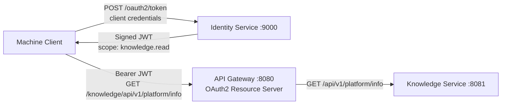

# Architecture

## Current topology



The Identity Service issues access tokens and publishes its RSA public key. The
API Gateway validates each Bearer token before forwarding protected knowledge
requests. The Knowledge Service does not validate tokens yet; that
defense-in-depth layer is intentionally isolated into the next feature branch.

## API Gateway

The API Gateway is the public entry point for platform APIs.

- Runs on port `8080`.
- Uses Spring Cloud Gateway Server WebFlux and Reactor Netty.
- Matches requests with the `/knowledge/**` path predicate.
- Applies `StripPrefix=1` before forwarding.
- Uses `KNOWLEDGE_SERVICE_URL` when supplied and otherwise uses `http://localhost:8081`.
- Acts as a reactive OAuth2 Resource Server.
- Uses `IDENTITY_ISSUER` and `IDENTITY_JWK_SET_URI` to validate JWTs.
- Requires `SCOPE_knowledge.read` for `/knowledge/**`.
- Validates the JWT signature, issuer, expiration, and not-before time.
- Forwards the original Bearer token to the downstream service.
- Keeps Actuator health and information endpoints public.
- Leaves unmatched routes public so the Gateway can return HTTP `404`.

```text
Incoming:  /knowledge/api/v1/platform/info
Forwarded: /api/v1/platform/info
```

## Knowledge Service

The Knowledge Service is the first backend microservice.

- Runs on port `8081`.
- Uses Spring Boot Web MVC.
- Exposes `GET /api/v1/platform/info`.
- Uses controller, service, and DTO layers.

Persistence, messaging, AI integration, and service-level authorization will
be introduced incrementally in their own feature branches and milestones.

## Identity Service

The Identity Service is the platform's OAuth2 authorization server.

- Runs on port `9000`.
- Uses Spring Authorization Server.
- Registers the `platform-client` machine client.
- Supports the `client_credentials` grant and `client_secret_basic`
  authentication.
- Issues RSA-signed JWT access tokens with the `knowledge.read` scope.
- Publishes authorization-server metadata and its public JSON Web Key Set.
- Uses a 15-minute access-token lifetime.
- Keeps `/actuator/health` public for operational health checks.

Spring Security uses two ordered filter chains. The first handles OAuth2
protocol endpoints. The second handles application endpoints and explicitly
allows unauthenticated health checks.

## Health monitoring

All three services include Spring Boot Actuator and expose
`/actuator/health`. Actuator auto-configures these endpoints; custom health
controllers are unnecessary.
