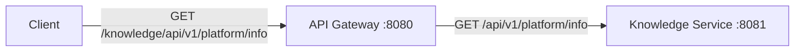

# Architecture

## Milestone 1 topology



## API Gateway

The API Gateway is the public entry point for platform APIs.

- Runs on port `8080`.
- Uses Spring Cloud Gateway Server WebFlux and Reactor Netty.
- Matches requests with the `/knowledge/**` path predicate.
- Applies `StripPrefix=1` before forwarding.
- Uses `KNOWLEDGE_SERVICE_URL` when supplied and otherwise uses `http://localhost:8081`.

```text
Incoming:  /knowledge/api/v1/platform/info
Forwarded: /api/v1/platform/info
```

## Knowledge Service

The Knowledge Service is the first backend microservice.

- Runs on port `8081`.
- Uses Spring Boot Web MVC.
- Exposes `GET /api/v1/platform/info`.
- Uses controller, service, and DTO layers.

Persistence, messaging, AI integration, and security will be introduced in their own milestones.

## Health monitoring

Both services include Spring Boot Actuator and expose `/actuator/health`. Actuator auto-configures these endpoints; custom health controllers are unnecessary.
