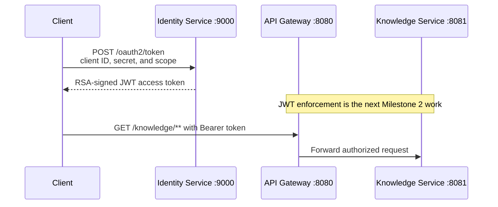

# Identity and Security

## Current scope

The Identity Service is the first feature in Milestone 2. It authenticates a
machine client and issues signed access tokens. The API Gateway and Knowledge
Service will validate and enforce those tokens in later feature branches.

## OAuth2 client-credentials flow



The client-credentials grant represents service-to-service authentication.
There is no interactive user or login form involved in obtaining this token.

## Development client

| Setting | Value |
|---|---|
| Client ID | `platform-client` |
| Default local secret | `platform-secret` |
| Client authentication | `client_secret_basic` |
| Grant type | `client_credentials` |
| Scope | `knowledge.read` |
| Access-token lifetime | 15 minutes |

The source configuration stores the secret as an environment-variable
placeholder:

```text
PLATFORM_CLIENT_SECRET
```

The local fallback uses Spring Security's `{noop}` password encoding marker.
That fallback is intentionally limited to development.

## Endpoints

| Method | Endpoint | Purpose |
|---|---|---|
| `POST` | `/oauth2/token` | Authenticate the client and issue an access token |
| `GET` | `/.well-known/oauth-authorization-server` | Publish OAuth2 server metadata |
| `GET` | `/oauth2/jwks` | Publish the RSA public key used to verify JWT signatures |
| `GET` | `/actuator/health` | Report service health |

## Security filter chains

`SecurityConfig` defines two ordered servlet security chains:

1. The authorization-server chain matches OAuth2 protocol endpoints and applies
   Spring Authorization Server.
2. The application chain permits health and information endpoints while
   requiring authentication for other application requests.

The ordering matters. OAuth2 requests must reach the protocol-aware chain
before the general application chain.

## Token request

```bash
curl -u platform-client:platform-secret \
  -X POST http://localhost:9000/oauth2/token \
  -H "Content-Type: application/x-www-form-urlencoded" \
  -d "grant_type=client_credentials&scope=knowledge.read"
```

A successful response contains:

- `access_token`: the signed JWT
- `token_type`: `Bearer`
- `expires_in`: `900`
- `scope`: `knowledge.read`

Invalid client credentials return HTTP `401`.

## Automated verification

The Identity Service integration suite verifies:

- Spring application startup
- OAuth2 metadata
- RSA public-key publication
- public health access
- successful JWT issuance
- issuer, subject, and scope claims
- rejection of an invalid client secret

Run it from the repository root:

```bash
mvn -pl identity-service -am test
```
